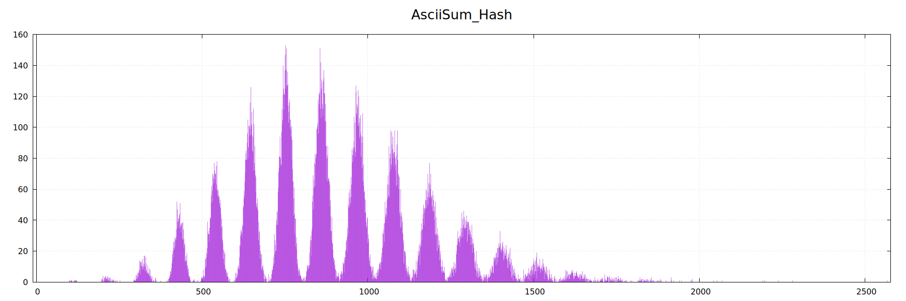

# Hash optimizing

Реализация структуры данных хэш-таблицы, с изначальной намеренно медленной производительностью, и впоследствии выявление слабых мест программы и улучшение их.

## Базовый Функционал хэш-таблицы
  - Каждый бакет реализован в виде двусвязного списка со вставкой и удалением за О(1)
  - Возможность применить любую хэш функцию для работы с хэш таблицей.
  - Добавление строки
  - Поиск строки

## Метод тестирования

### Обучающие наборы
Загружаемый в хэш-таблицу набор состоит из половины словаря Американского английского языка (`texts/usa.txt`). Всего в нем насчитывается 37811 уникальных слов. При количестве бакетов 4999 (простое число для минимизации коллизий) Load Factor примерно равен 7.6, что достаточно для получения заметных результатов оптимизации.

В качестве тестируемого набора была выбрана Книга "Компьютерные системы. Архитектура и программирование" Рэндала Э. Брайанта и Дэвида Р. О'Халларона, предварительно обработанная  от лишних utf-8 символов скриптом `scripts/GetRidOfDelims.py`. Количество слов: 388362

### Что измеряем

Для выбранной хэш функции будем измерять общее время выполнения программы: загрузку словаря в хэш-таблицу + поиск слов из тестируемого набора.
Измерения будем проводить при помощи hyperfine.
Для повторения теста:
 ```
hyperfine ./bin/hash texts/usa.txt --warmup 5 --runs 20 --export-csv <out_file_name>.txt
 ```

Для анализа того, какая функция нуждается в оптимизации будет использовалось профилирование инструментом callgrind.
```
valgrind  --tool=callgrind
          --callgrind-out-file=callgrind.out.<out_file_name>
          ./bin/hash texts/usa.txt
```
Для удобства рассмотрения полученных данных в графическом виде используется программа `kcachegrind`.

## Первая версия: результаты

Сравнивалось 9 хеш функций:
1) ### THEBESTHASHFUNCINTHEWORLD
    Она просто возвращает 0. Все слова попадают в один бакет
   Время выполнения: 84.958 ± 0.783с
   
2) ### FirstAsciiChar
    Возвращает ascii код первой буквы
   Время выполнения: 2.910 ± 0.008с
   
3) ### AsciiSum
   Возвращает сумму всех ASCII кодов в строке.
   Время выполнения: 0.348 ± 0.004с
   
   

   
5) ### Strlen
    Возвращает длину строки
   Время выполнения: 5.443 ± 0.024с
   
6) ### Rollleft
   На каждой итерации использует цикл. сдвиг влево с XOR'ом ASCII кода символа
   Время выполнения: 0.304 ± 0.002с
   
7) ### Rollright
   Работает также как и Rollleft, только сдвиг вправо, а не влево.
   Время выполнения: 0.323 ± 0.002с
   
8) ### SDBM
   Версия GNU hash, рекуррентная хэш функция, в каждой итерации происходит умножение хэша на константу 65559 и сложение с ascii кодом
   Время выполнения: 0.307 ± 0.003с
   
9) ### CRC32
   Изначально алгоритм задумывался для обнаружения случайных ошибок в сообщении, но за его быстроту он нашел себе место в множестве хэш функций.
   Время выполнения: 0.311 ± 0.001с
   
10) ### FNV1A
   Популярный алгоритм хэширования, известный за маленькое количество коллизий на средних и малых строках.
   Время выполнения: 0.314 ± 0.005с
   

### Таблица результатов
| Название функции            | Время Выполнения, с  |   Дисперсия      | Load Factor |   Хи-Квадрат      |
|-----------------------------|----------------------|------------------|-------------|-------------------|
| AsciiSum.txt         | 0.347769 ± 0.003893  | 452.539650       | 7.563313    | 323404.571429     |                                 
| Rollleft.txt         | 0.303567 ± 0.002335  | 16.582859        | 7.563313    | 12069.142857      |                                 
| Rollright.txt        | 0.323492 ± 0.002031  | 47.312205        | 7.563313    | 34014.285714      |                                 
| SDBM.txt             | 0.307145 ± 0.003037  | 7.436230         | 7.563313    | 5537.142857       |                             
| CRC32.txt            | 0.311401 ± 0.001114  | 7.793101         | 7.563313    | 5792.000000       |                             
| FNV1A.txt            | 0.314088 ± 0.004759  | 7.476638         | 7.563313    | 5566.000000       |                             
| FirstAsciiChar.txt   | 2.910116 ± 0.008284  | 22041.096162     | 7.563313    | 15740718.000000   |                                    
| Strlen.txt           | 5.443138 ± 0.024737  | 31888.328808     | 7.563313    | 22773048.857143   |                             
| AlwaysZero.txt       | 84.958145 ± 0.783262 | 285904.084759    | 7.563313    | 204176586.571429  | 

Из этой таблицы Видно, что функции с наименьшей дисперсией и Хи-Квадратом - SDBM, CRC32, FNV1A, дальнейшие замеры скорости будем проводить для функции CRC32, так как она имеет более хорошую аппаратную поддержку.
Увеличим набор тестируемых слов до 612 тысяч и будем повторять измерения 100 раз для более точных результатов. На таком наборе 32556900/61294800 слов помечаются как найденные.

### На новом наборе:
  | Оптимизация | Название функции     | Время Выполнения, с  |
  |-------------|----------------------|----------------------|
  | O3          | SRC32                | 7.960 ± 0.062        |
  | O2          | CRC32                | 8.014 ± 0.055        |
  | O0          | CRC32                | 16.804 ± 0.158       |
  
## Профилировщик функции CRC32


## Оптимизация Хеш функций
  Т.к. хеш функция CRC32 занимает 37% всего времени выполнения, ускорим ее работу. Для этого используем аппаратно поддерживаемый интринсик для подсчета данной хеш функции: _mm_crc32_u64
  | Название функции     | Время Выполнения, с  |
  |----------------------|----------------------|                           
  | MyCRC32              | 5.770 ± 0.144        |

## Профилировщик функции CRC32

  
  
  Получили ускорение в почти 7 раз хеш функции CRC32, общее ускорение программы составило 32%

## Оптимизация бакетов
  До данного момента каждая ячейка хэш функции представляла из себя двусвязный список. И функции итерации списка вместе с strcmp составляли около 60% от всего времени выполнения. Было решено поменять список в каждом бакете на структуру из трёх массивов: массив длин, массив хешей и массив данных. При добавлении и поиска отдельного слова в хеш функции, было решено сравнивать сначала хеши из массива хешей, потом длины слов и потом сами слова посимвольно. В отличие от предыдущего метода, где мы сразу проверяли строки посимвольно, в новом мы поняли, что большинство слов отличаются хешем и длиной слова, и чаще всего слова отличаются именно хешем и длиной, а сравнить два числа легче, чем сравнивать все символы подряд.
  
  | Название функции  | Время Выполнения, с   |
  |-------------------|-----------------------|
  | MyCRC32           | 2.300 ± 0.128         |

  Получили ускорение в 2.51 раз. 
  
  ## Профилировщик функции MyCRC32
  


## Оптимизация Strlen и Strcmp
  Видим, что в среднем функции strlen + strcmp занимают около 21% всего времени. Попробуем их оптимизировать с помощью:
  - __asm вставки (ASMINLINE тип)
  - отдельной asm функции (ASM тип)

| Название функции            | Тип программы  | Время Выполнения, с  |
|-----------------------------|----------------|----------------------|
| MyCRC32                     | ASMINLINE      | 1.974 ± 0.093        |
| MyCRC32                     | ASM            | 2.105 ± 0.071        |                 

Получили ускорение примерно на 15%

## Профилировщик MyCRC32


## Итоги
| Оптимизация       | Время          | Ускорение этапа  | Ускорение общее |
|-------------------|----------------|------------------|-----------------|
| без опт           | 7.960 ± 0.062  | -                | -               |
| Хеш функции       | 5.770 ± 0.144  | 1.32             | 1.32            |
| SoA бакеты        | 2.300 ± 0.128  | 2.51             | 3.30            |
| Strlen + Strcmp   | 1.974 ± 0.093  | 1.15             | 3.82            |
