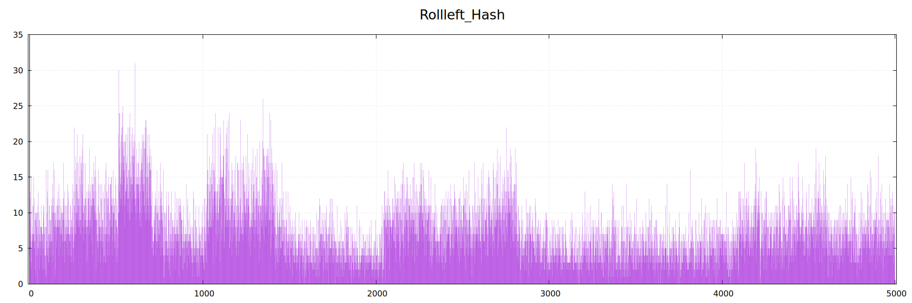
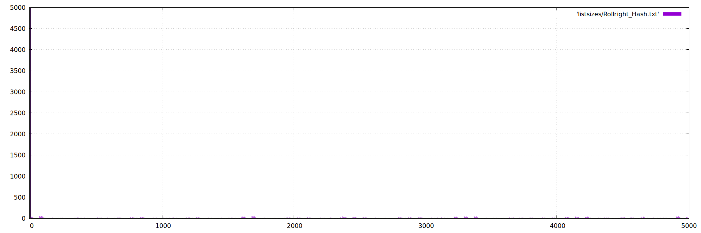
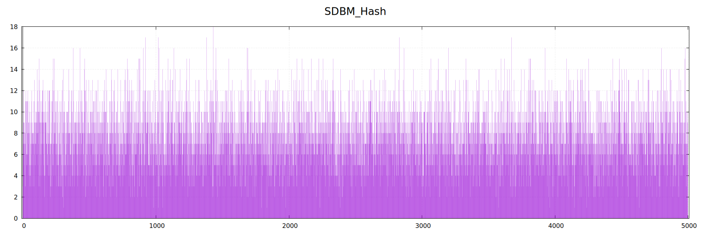
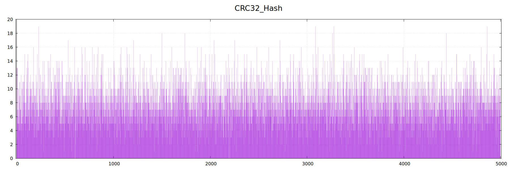
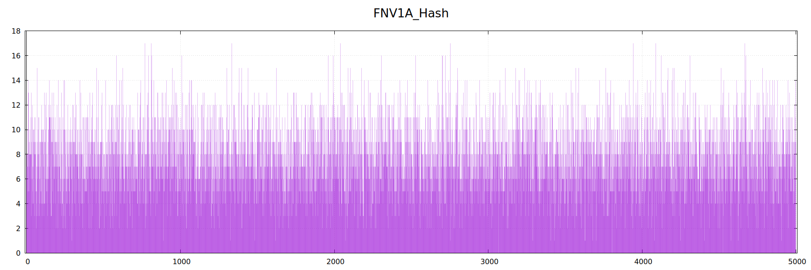
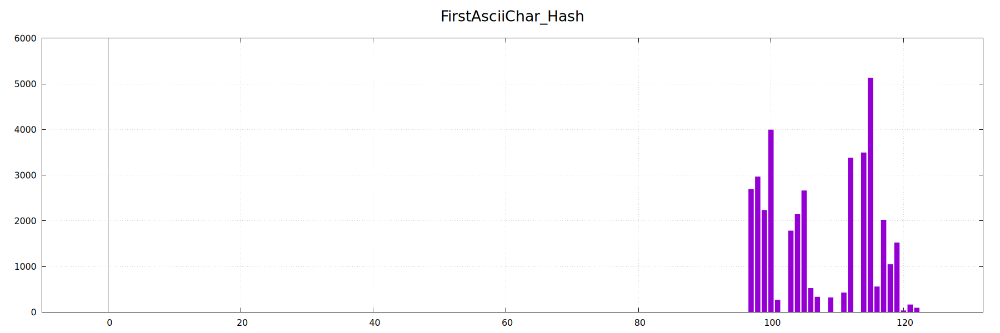
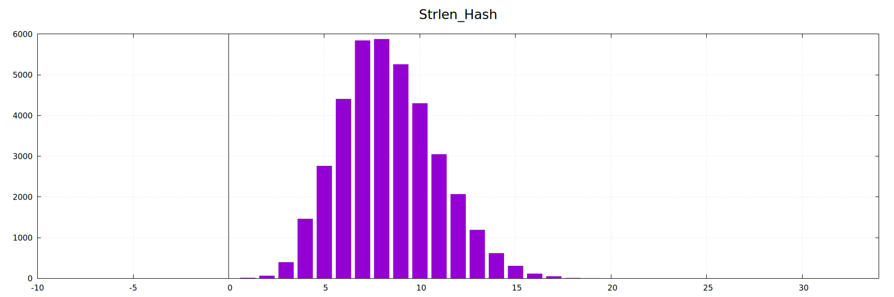
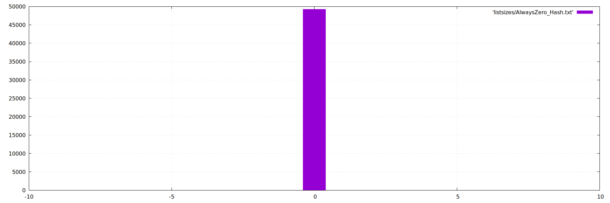

# Hash optimizing

Реализация структуры данных хэш-таблицы, с изначальной намеренно медленной производительностью, и впоследствии выявление слабых мест программы и улучшение их.

## Базовый Функционал хэш-таблицы
  - Каждый бакет реализован в виде двусвязного списка со вставкой и удалением за О(1)
  - Возможность применить любую хэш функцию для работы с хэш таблицей.
  - Добавление строки
  - Поиск строки

## Метод тестирования

### Обучающие наборы
Загружаемый в хэш-таблицу набор состоит из половины словаря Американского английского языка (`texts/usa.txt`). Всего в нем насчитывается 37811 уникальных слов. При количестве бакетов 4999 (простое число для минимизации коллизий) Load Factor примерно равен 7.6, что достаточно для получения заметных результатов оптимизации.

В качестве тестируемого набора была выбрана Книга "Компьютерные системы. Архитектура и программирование" Рэндала Э. Брайанта и Дэвида Р. О'Халларона, предварительно обработанная  от лишних utf-8 символов скриптом `scripts/GetRidOfDelims.py`. Количество слов: 388362

### Что измеряем

Для выбранной хэш функции будем измерять общее время выполнения программы: загрузку словаря в хэш-таблицу + поиск слов из тестируемого набора.
Измерения будем проводить при помощи hyperfine.
Для повторения теста:
 ```
hyperfine ./bin/hash texts/usa.txt --warmup 5 --runs 5 --export-csv <out_file_name>.txt
 ```

Для анализа того, какая функция нуждается в оптимизации будет использовалось профилирование инструментом callgrind.
```
valgrind  --tool=callgrind
          --callgrind-out-file=callgrind.out.<out_file_name>
          ./bin/hash texts/usa.txt
```
Для удобства рассмотрения полученных данных в графическом виде используется программа `kcachegrind`.

## Первая версия: результаты

AsciiSum_Hash_E.txt	0.347769	0.003893
Rollleft_Hash_E.txt	0.303567	0.002335
Rollright_Hash_E.txt	0.323492	0.002031
SDBM_Hash_E.txt	0.307145	0.003037
CRC32_Hash_E.txt	0.311401	0.001114
FNV1A_Hash_E.txt	0.314088	0.004759
FirstAsciiChar_Hash_E.txt	2.910116	0.008284
Strlen_Hash_E.txt	5.443138	0.024737
AlwaysZero_Hash_E.txt	84.958145	0.783262

Сравнивалось 9 хеш функций:
1) ### AsciiSum
   Возвращает сумму всех ASCII кодов в строке.
   Время выполнения: 0.348 ± 0.004с
   
2) ### Rollleft
   На каждой итерации использует цикл. сдвиг влево с XOR'ом ASCII кода символа
   Время выполнения: 0.304 ± 0.002с
   
2) ### Rollright
   Работает также как и Rollleft, только сдвиг вправо, а не влево.
   Время выполнения: 0.323 ± 0.002с
   
3) ### SDBM
   Версия GNU hash, рекуррентная хэш функция, в каждой итерации происходит умножение хэша на константу 65559 и сложение с ascii кодом
   Время выполнения: 0.307 ± 0.003с
   
5) ### CRC32
   Изначально алгоритм задумывался для обнаружения случайных ошибок в сообщении, но за его быстроту он нашел себе место в множестве хэш функций.
   Время выполнения: 0.311 ± 0.001с
   
7) ### FNV1A
   Популярный алгоритм хэширования, известный за маленькое количество коллизий на средних и малых строках.
   Время выполнения: 0.314 ± 0.005с
   
9) ### FirstAsciiChar
    Возвращает ascii код первой буквы
   Время выполнения: 2.910 ± 0.008с
   
11) ### Strlen
    Возвращает длину строки
   Время выполнения: 5.443 ± 0.024с
   
12) ### THEBESTHASHFUNCINTHEWORLD
    Она просто возвращает 0. Все слова попадают в один бакет
   Время выполнения: 84.958 ± 0.783с
   


